# C4 Architecture Diagrams

**Project:** Echelon
**Analysis Date:** 2025-12-24

---

## 1. Level 1: System Context Diagram

**Context:** Echelon acts as a central multi-agent RL environment, receiving training commands from PPO scripts and exposing observations/rewards through a Gymnasium-compatible interface.

---

## 2. Level 2: Container Diagram

---

## 3. Level 3: Simulation Core Components

---

## 4. Level 3: Environment Components

```mermaid
graph TB
    subgraph Episode["Episode Management"]
        Reset["reset()"]
        Step["step(actions)"]
        Terminate["Termination Check"]
    end

    subgraph Observation["Observation (607 dims)"]
        Contacts["Contacts<br/>110 dims"]
        PackComm["Pack Comm<br/>80 dims"]
        LocalMap["Local Map<br/>121 dims"]
        Telemetry["Telemetry<br/>256 dims"]
        SelfFeatures["Self Features<br/>40 dims"]
    end

    subgraph Rewards["Reward Shaping"]
        ZoneTick["Zone Control (0.10)"]
        Approach["Approach (0.25)"]
        Damage["Damage (0.005)"]
        Kill["Kill (1.0)"]
        Terminal["Terminal (±5.0)"]
    end

    Reset --> Contacts
    Reset --> LocalMap
    Reset --> Telemetry

    Step --> Contacts
    Step --> PackComm
    Step --> SelfFeatures
    Step --> ZoneTick
    Step --> Approach
    Step --> Damage
    Step --> Kill

    Terminate --> Terminal
```

---

## 5. Level 3: Procedural Generation Pipeline

---

## 6. Data Flow: Training Loop

---

## 7. Data Flow: Self-Play Loop

---

## Summary

| Diagram | Purpose |
|---------|---------|
| Level 1: System Context | External actors and systems |
| Level 2: Container | Major subsystem containers and data flow |
| Level 3: Simulation | Physics, combat, targeting components |
| Level 3: Environment | Observation and reward construction |
| Level 3: Generation | Procedural map synthesis pipeline |
| Data Flow: Training | PPO training loop |
| Data Flow: Self-Play | League and Glicko-2 rating flow |

---

*Generated on 2025-12-24*
